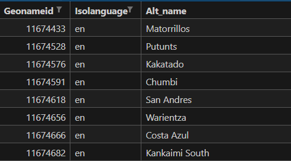

# Foreign language or alternative location names from Geonames.org

## An experimentation in data parsinng and processing

In this repository, I go through some of the ways you can parse and process the location translation / altnames / alternative names / location name in a foreign language database from Geonames.org.

> Please note that this database is in active development.

The alternames database contains geoname_id, language, and the name of the location in that language.



The Geonames.org dataset is quite large and a bit messy. So this repo contains:
- A [notebook](geoname_alt_names.zip) that demonstrates a data parsing process.
- A [zip file](geoname_alt_names.zip) contains the parsed and processed CSV and JSON files.


These files can be used in combination with IPinfo's [IP to Location database](https://ipinfo.io/products/ip-geolocation-database). Use the `geoname_id` field to look up the values from the CSV and JSON files shared in this repo.

However, please note that Geonames.org does not provide a complete database, so be prepared for missing data. Alternatively, you can tweak the parameters of the notebook to generate your own version of parsed geoname altname/foreign language location names.

> I highly recommend checking out the included Jupyter Notebook to understand the process of parsing this data.

Looking up the IP location using [IPinfo IP to Location data downloads](https://ipinfo.io/products/ip-geolocation-database)

```bash
mmdbctl read 137.93.255.181 location.mmdb
```

```json
{
  "city": "Oslo",
  "country": "NO",
  "geoname_id": "3143244", <-----------------
  "lat": "59.9127",
  "lng": "10.7461",
  "postal_code": "0277",
  "region": "Oslo",
  "region_code": "03",
  "timezone": "Europe/Oslo"
}
```

Getting the altname using the included JSON file:

```python
>>> geoname_alt_names[geoname_id] # 3143244

{'pt': 'Oslo', 'en': 'Oslo', 'ko': '오슬로', 'ru': 'Осло', 'ja': 'オスロ', 'ar': 'أوسلو', 'es': 'Oslo', 'zh': '奥斯陆', 'de': 'Oslo', 'fr': 'Oslo'}
```

Aside from the ISO language code, the dataset also contains the `preferred` (preferred or official name) and `shortname` (shortname for the location) values.

Notes / Subjective Decisions:

> This is the beginning of a public database project. So, your opinion matters. Please open an issue to provide feedback.

- Note that for rows where the `preferred` ISO language is `en`, we have removed them as if the `preferred` ISO language is not present, the fallback value should default to English.
- Where multiple entries are made for the same language, we have chosen the first entry. There obviously a better solution for this.

The included notebook and databases can be used with a variety of IPinfo IP databases that include location information.

----

This project utilizes data from Geonames.org, a geographical database covering all countries and containing over eleven million placenames. Geonames data is licensed under a Creative Commons Attribution 4.0 License. 